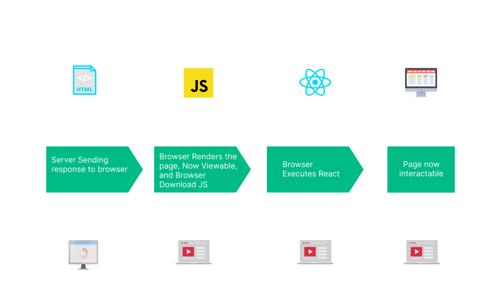
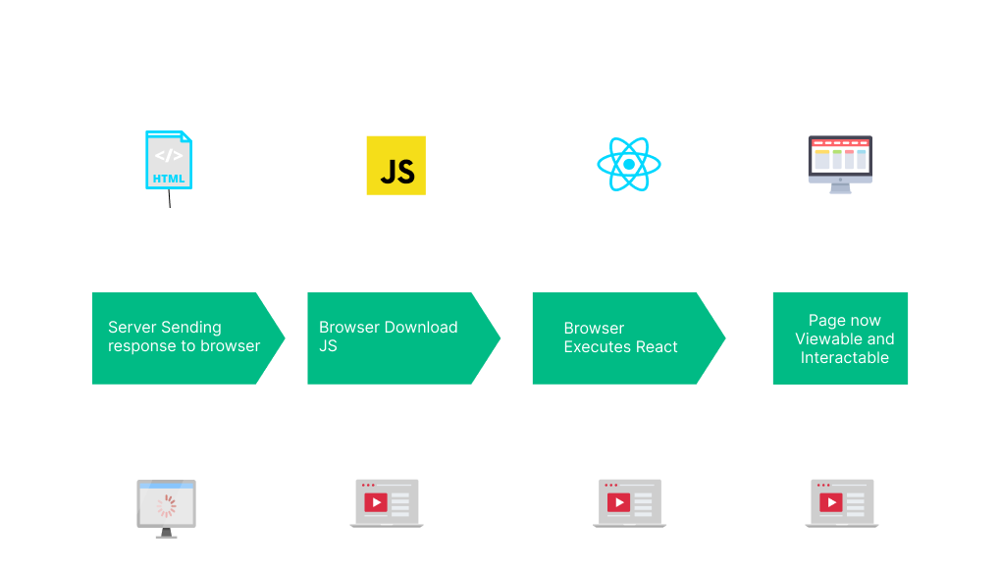

## 김영한님의 강의를 따라 한 토이 프로젝트

### 느낀점<br>
웹 프로젝트를 학원 다녔을 때 잠깐 배웠었는데, 뷰 템플릿 엔진은 JSP 를 사용했었다.<br>
실무에서는 웹 프로젝트를 한 번도 하지 않았었고, REST API 만 구현했었던 입장이었다.<br>
요즘 뷰 템플릿 엔진으로 thymeleaf 가 대세라는 건 알고 있었지만, 처음 사용해보기 때문에 내용이 쉽지는 않았다.<br>

또한, [Redirect](#Redirect) 처리하는 것도 처음 경험해보았다.<br>
Redirect 라는 용어는 많이 사용해 본 적이 있었지만, 실제로 처리하면서 어떻게 흘러가는지에 대해 파악할 수 있어서 좋았다.<br> 

그래도 스프링 MVC 1편 강의에서 배웠던 내용을 기본으로 프로젝트를 구현하여서 구조 및 흐름에 대해서는 쉽게 이해 할 수 있었다. 

---
### Thymeleaf
> 웹 사이트를 위한 서버사이드 자바 템플릿 엔진으로, [서버 사이드 HTML 렌더링](#SSR) 성격을 지닌다.<br>


공식 문서
* [thymeleaf 기본 기능 공식 사이트](https://www.thymeleaf.org/doc/tutorials/3.0/usingthymeleaf.html)<br>
* [thymeleaf 스프링 통합](https://www.thymeleaf.org/doc/tutorials/3.0/thymeleafspring.html)

---
### Redirect
상품 목록에서 상품 등록을 클릭했을 때, `GET 방식의 /items/add` 컨트롤러가 호출된다.<br>
**상품을 등록하면 다음과 같은 화면이 노출**된다.<br>


화면을 보면 좀 의아한 부분이 있다.<br>
`상품 상세` 페이지라고 생각할 수 있는데, URL 을 보면 `localhost:8080/items/add` 이다.<br>
이게 어떻게 된 일 일까?<br>
상품 등록 함수를 보면, `return "/basic/item";` 으로 뷰를 리턴하고 있다.(`/basic/item` 뷰는 전부 **readonly** 로 되어있다.)
```
@PostMapping("/add")
public String save(@ModelAttribute Item item) {
    itemRepository.save(item);
    
    return "basic/item";
}
```
클라이언트의 요청(노란 형광펜)을 한번 확인해 보면, 클라이언트는 POST 방식의 `items/add` 요청을 보냈다.<br>
하지만 서버가 내부적으로 `/basic/item` 를 리턴한다.<br>
즉, 클라이언트는 본인이 직접 `상품 상세` 페이지를 보여달라고 요청하지 않았지만 서버가 내부적으로 `상품 상세` 페이지를 보여주고 있는 것이다.<br>

그래서 상품 상세라고 생각한 이 페이지를 재 로드(새로고침) 하였을 때, 실행되는 것은 `상품 등록` 요청이다!<br>

의도한 바가 위와 같다면 위와 같이 진행해도 좋겠지만, 그렇지 않을 경우 어떻게 해결하면 좋을까?<br>
바로 `Redirect` 를 사용하는 것이다.<br>
프로젝트에서 수정 페이지 때 Redirect 를 사용했는데 한번 확인해보자.<br>
상품 수정 함수를 보면, `return "redirect:/items/{itemId}";` 로 되어있다.<br>
뷰 주소가 아닌 실제 상품 상세 화면 주소로 리다이렉트를 호출하는 것인데, 웹 브라우저는 리다이렉트의 영향으로 상품을 수정한 후에 상품 상세 화면으로 다시 이동하게 된다.<br>

```
@PostMapping("/{itemId}/edit")
public String edit(@ModelAttribute Item item) {
    itemRepository.updateById(item.getId(), item);
    return "redirect:/items/{itemId}";
}
```

수정 페이지의 흐름을 한번 확인해보자.


클라이언트는 `GET 방식의 items/1/edit` 요청(노란 형광펜)하여 상품 수정 페이지로 들어왔다.


클라이언트가 상품 내용을 수정한 후 저장하였을 때 요청(노란 형관펜)은 `POST 방식의 items/1/edit` 이다.<br>
하지만 브라우저의 현재 url 을 보면 `localhost:8080/items/1` 이다.<br>
이는 `redirect` 의 영향으로 실제 상품 상세 페이지로 이동한 것이다.<br>

그럼 사용자는 상품 상세 페이지에서 재 로드(새로고침)을 해도 실행되는 것은 상품 수정 요청이 아니라 상품 상세 페이지 요청이 된다!<br>

이 흐름과 같이 클라이언트에서 수정 내용 저장 요청(POST) -> 서버에서 수정 완료 후 상세 페이지로 이동(Redirect) -> 상세 페이지 이동(GET) 하는 것을 [PRG 패턴](#PRG-패턴)이라고 부른다.<br>

---

### PRG 패턴
> 양식 제출 후 표시되는 페이지를 다시 로드, 공유 또는 다른 양식 제출과 같은 악영향 없이 북마크할 수 있도록 하는 웹 개발 디자인 패턴이다. - 위키백과


### SSR
Server Side Rendering 의 약자로, 서버는 클라이언트한테 보여 줄 페이지를 렌더링하여 브라우저한테 전달한다.<br>
그럼 웹 브라우저는 서버로부터 받은 페이지(이미 다 그려진)를 클라이언트한테 보여준다.<br>

동작 방식

1. 서버는 페이지를 그려서 브라우저한테 전달한다.
2. 브라우저는 클라이언트한테 서버로부터 받은 페이지를 보여주면서, 페이지와 관련된 JS 파일을 다운로드 받는다.
   * 클라이언트는 화면을 볼 수 있지만, 기능(서버의 동작이 필요한)을 사용할 수 없다.
   * 브라우저는 사용자가 원하는 기능을 기억하고 있다.
     * 예를 들어, JS 다운로드 되기 전에 회원 가입하기 버튼을 누르면 동작하지 않지만 해당 기능을 기억하고 있어서 JS 다운로드가 완료되면 회원 가입으로 진입한다. 
3. JS 가 다운로드 되면 웹 페이지는 상호작용이 가능한 상태가 된다.

이점<br>
* SEO 에 최적화되어있다.
* 초기 로딩이 빠르다
* LCP

단점<br>
* 서버의 부하가 심하다.
* TTV(Time To View) 와 TTI(Time To Interact) 시간 존재

### CSR
Client Side Rendering 의 약자로, 브라우저가 페이지를 렌더링한다.<br>
즉, 서버에서 받은 결과 값을 활용하여 페이지를 그려서 클라이언트한테 보여준다.<br>

동작 방식

첨부된 SSR 이미지와 대체 무엇이 다를까, 내용을 얽어봐도 사실 이해하기 힘들었다.<br>
1. 서버는 브라우저로 결과 값을 리턴한다.
   * 아마도 HTML 도 받겠지만, HTML 내용은 전부 비어있다.
2. 브라우저는 JS를 다운로드 받는다.
3. 


이점<br>
* UI 가 좋다
* 서버의 부하가 덜 하다.

단점<br>
* 초기 로딩이 느리다.
* SEO 를 활용하기 쉽지 않다.

정리<br>
SSR 과 CSR 의 다른 포인트는 `어디서 페이지를 렌더링 할 것인가` 이다.<br>

참고<br>
https://scythe-studio.com/en/blog/web-development/client-side-vs-server-side-rendering