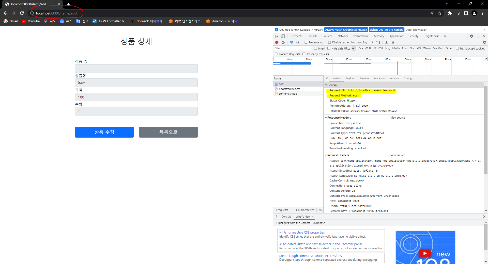
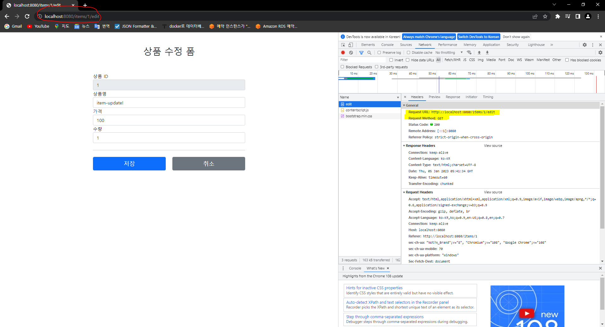
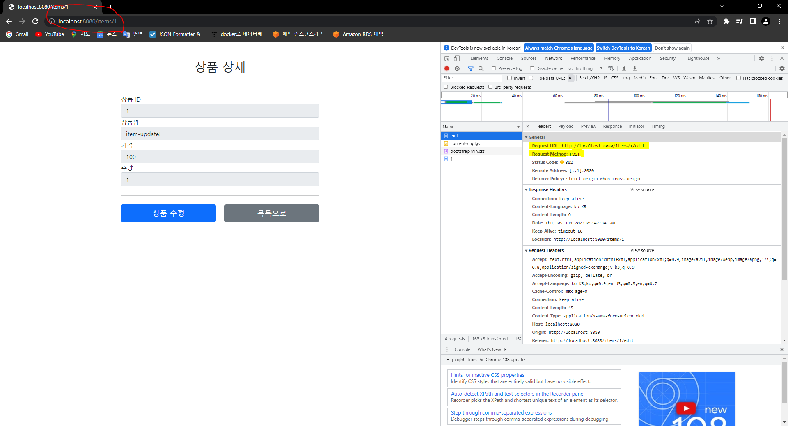
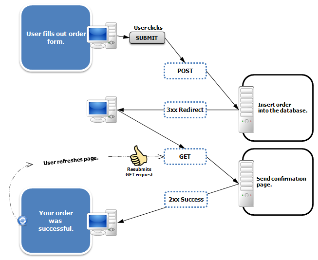

## 김영한님의 강의를 따라 한 토이 프로젝트

### 느낀점<br>
웹 프로젝트를 학원 다녔을 때 잠깐 배웠었는데, 뷰 템플릿 엔진은 JSP 를 사용했었다.<br>
실무에서는 웹 프로젝트를 한 번도 하지 않았었고, REST API 만 구현했었던 입장이었다.<br>
요즘 뷰 템플릿 엔진으로 [thymeleaf](https://github.com/kim-se-yeong/spring-boot-study/tree/main/mvc/src/main/java/com/example/thymeleaf) 가 대세라는 건 알고 있었지만, 처음 사용해보기 때문에 내용이 쉽지는 않았다.<br>

또한, [Redirect](#Redirect) 처리하는 것도 처음 경험해보았다.<br>
Redirect 라는 용어는 많이 사용해 본 적이 있었지만, 실제로 처리하면서 어떻게 흘러가는지에 대해 파악할 수 있어서 좋았다.<br> 

그래도 스프링 MVC 1편 강의에서 배웠던 내용을 기본으로 프로젝트를 구현하여서 구조 및 흐름에 대해서는 쉽게 이해 할 수 있었다. 

---
### Redirect
상품 목록에서 상품 등록을 클릭했을 때, `GET 방식의 /items/add` 컨트롤러가 호출된다.<br>
**상품을 등록하면 다음과 같은 화면이 노출**된다.<br>



화면을 보면 좀 의아한 부분이 있다.<br>
`상품 상세` 페이지라고 생각할 수 있는데, URL 을 보면 `localhost:8080/items/add` 이다.<br>
이게 어떻게 된 일 일까?<br>
상품 등록 함수를 보면, `return "/basic/item";` 으로 뷰를 리턴하고 있다.(`/basic/item` 뷰는 전부 **readonly** 로 되어있다.)
```
@PostMapping("/add")
public String save(@ModelAttribute Item item) {
    itemRepository.save(item);
    
    return "basic/item";
}
```
클라이언트의 요청(노란 형광펜)을 한번 확인해 보면, 클라이언트는 POST 방식의 `items/add` 요청을 보냈다.<br>
하지만 서버가 내부적으로 `/basic/item` 를 리턴한다.<br>
즉, 클라이언트는 본인이 직접 `상품 상세` 페이지를 보여달라고 요청하지 않았지만 서버가 내부적으로 `상품 상세` 페이지를 보여주고 있는 것이다.<br>

그래서 상품 상세라고 생각한 이 페이지를 재 로드(새로고침) 하였을 때, 실행되는 것은 `상품 등록` 요청이다!<br>

의도한 바가 위와 같다면 위와 같이 진행해도 좋겠지만, 그렇지 않을 경우 어떻게 해결하면 좋을까?<br>
바로 `Redirect` 를 사용하는 것이다.<br>
프로젝트에서 수정 페이지 때 Redirect 를 사용했는데 한번 확인해보자.<br>
상품 수정 함수를 보면, `return "redirect:/items/{itemId}";` 로 되어있다.<br>
뷰 주소가 아닌 실제 상품 상세 화면 주소로 리다이렉트를 호출하는 것인데, 웹 브라우저는 리다이렉트의 영향으로 상품을 수정한 후에 상품 상세 화면으로 다시 이동하게 된다.<br>

```
@PostMapping("/{itemId}/edit")
public String edit(@ModelAttribute Item item) {
    itemRepository.updateById(item.getId(), item);
    return "redirect:/items/{itemId}";
}
```

수정 페이지의 흐름을 한번 확인해보자.


클라이언트는 `GET 방식의 items/1/edit` 요청(노란 형광펜)하여 상품 수정 페이지로 들어왔다.


클라이언트가 상품 내용을 수정한 후 저장하였을 때 요청(노란 형관펜)은 `POST 방식의 items/1/edit` 이다.<br>
하지만 브라우저의 현재 url 을 보면 `localhost:8080/items/1` 이다.<br>
이는 `redirect` 의 영향으로 실제 상품 상세 페이지로 이동한 것이다.<br>

그럼 사용자는 상품 상세 페이지에서 재 로드(새로고침)을 해도 실행되는 것은 상품 수정 요청이 아니라 상품 상세 페이지 요청이 된다!<br>

이 흐름과 같이 클라이언트에서 수정 내용 저장 요청(POST) -> 서버에서 수정 완료 후 상세 페이지로 이동(Redirect) -> 상세 페이지 이동(GET) 하는 것을 [PRG 패턴](#PRG-패턴)이라고 부른다.<br>

---

### PRG 패턴
> 양식 제출 후 표시되는 페이지를 다시 로드, 공유 또는 다른 양식 제출과 같은 악영향 없이 북마크할 수 있도록 하는 웹 개발 디자인 패턴이다. - 위키백과


