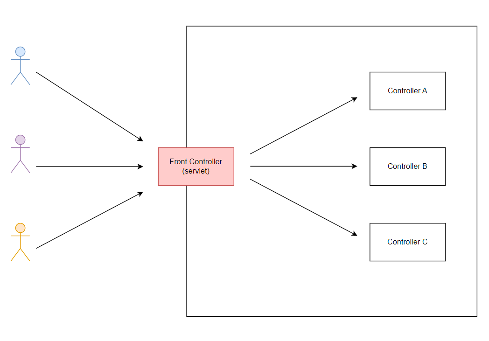

## 프론트 컨트롤러 활용 내용
What is Front Controller ?<br>
소프트웨어 디자인 패턴으로  웹 애플리케이션으로 들어오는 모든 요청을 하나의 서블릿으로 받는다.<br>



### Package v1
#### ✔ 프론트 컨트롤러 도입

<br>

### Package v2
#### ✔ View 의 분류a

단순 반복되는 View 로직 분류한다.
- 프론트 컨트롤러를 활용한 v1 예시에서 모든 컨트롤러가 **view 렌더링 하는 코드를 반복**하였으며 아래와 같이 사용하고 있다.
  ```
  RequestDispatcher dispatcher = request.getRequestDispatcher(viewPath);
  dispatcher.forward(request, response);
  ```
따라서 MyView 객체를 생성하였고, 이 객체를 통해 view 렌더링을 실행한다.

<br>

### Package v3
#### ✔ 서블릿 종속성 제거
#### ✔ ModelView 추가
각 컨트롤러는 ModelView 객체를 생성하여, 뷰의 논리적 이름과 모델을 반환한다.
#### ✔ 뷰 이름 중복 제거
프론트 컨트롤러를 활용한 v2 예시에서 모든 컨트롤러는 뷰의 물리적 위치를 작성하고 있다. <br>
예) `/view-path/new-form.jsp`, `/view-path/save-result.jsp`, `/view-path/phones.jsp`<br>
컨트롤러는 `뷰의 논리적 이름`만 반환하고, `실제 물리적 이름은 프론트 컨트롤러에서 viewResolver 를 통해 처리`하도록 한다.

<br>

### Package v4
#### ✔ 단순하고 실용적인 컨트롤러

컨트롤러는 ModelView 를 직접 생성해서 반환하지 않는다.<br>
즉, **프론트 컨트롤러가 모델을 직접 생성**하여 컨트롤러를 호출하며 컨트롤러는 모델에 값만 담고 **뷰 논리 이름**만 반환한다.<br>
따라서 컨트롤러에서 직접 모델을 생성하지 않아 더 간결하게 코드를 작성할 수 있게 되었다.

<br>

### Package v5
#### ✔ Adapter 도입

Adapter 를 추가해서 프레임워크를 유연하고 확장성 있게 설계한다.
