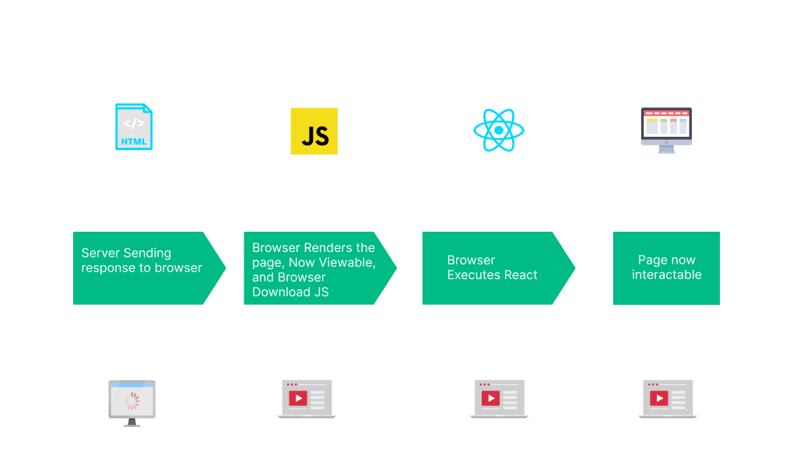
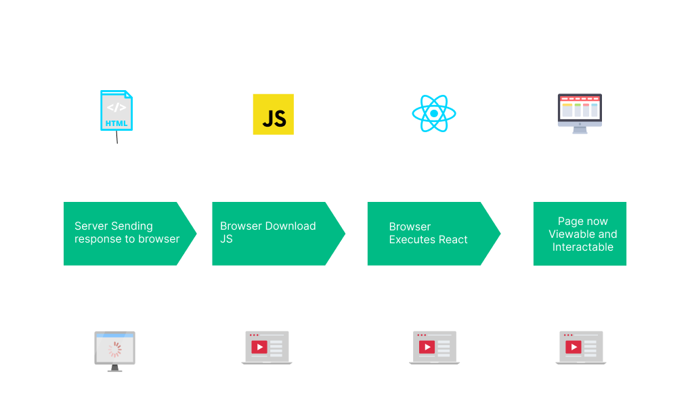

### Thymeleaf
> 웹 사이트를 위한 서버사이드 자바 템플릿 엔진으로, [서버 사이드 HTML 렌더링](#SSR) 성격을 지닌다. 

공식 문서
* [thymeleaf 기본 기능 공식 사이트](https://www.thymeleaf.org/doc/tutorials/3.0/usingthymeleaf.html) 
* [thymeleaf 스프링 통합](https://www.thymeleaf.org/doc/tutorials/3.0/thymeleafspring.html)

---

### SSR
Server Side Rendering 의 약자로, `서버는 클라이언트한테 보여 줄 페이지를 렌더링하여 브라우저한테 전달`한다. 
그럼 웹 브라우저는 서버로부터 받은 페이지(이미 다 그려진)를 클라이언트한테 보여준다. 

**동작 방식**

1. 서버는 페이지를 그려서 브라우저한테 전달한다.
2. 브라우저는 클라이언트한테 서버로부터 받은 페이지를 보여주면서, 페이지와 관련된 JS 파일을 다운로드 받는다.
    * **클라이언트는 화면을 볼 수 있지만, 기능(서버의 동작이 필요한)을 사용할 수 없다.**
    * 브라우저는 사용자가 원하는 기능을 기억하고 있다.
        * 예를 들어, JS 다운로드 되기 전에 회원 가입하기 버튼을 누르면 동작하지 않지만 해당 기능을 기억하고 있어서 JS 다운로드가 완료되면 회원 가입으로 진입한다.
3. JS 가 다운로드 되면 웹 페이지는 상호작용이 가능한 상태가 된다.

이점 
* SEO 에 최적화되어있다.
* 초기 로딩이 빠르다.
* LCP

단점 
* 서버의 부하가 심하다.
* TTV(Time To View) 와 TTI(Time To Interact) 시간 존재한다.

### CSR
Client Side Rendering 의 약자로, `브라우저가 페이지를 렌더링`한다. 
즉, 서버에서 받은 결과 값을 활용하여 페이지를 그려서 클라이언트한테 보여준다. 

**동작 방식**

첨부된 SSR 이미지와 대체 무엇이 다를까, 내용을 얽어봐도 사실 이해하기 힘들었다. 
1. 서버는 브라우저로 컨텐츠를 리턴한다.
   * 빈 뼈대만 있는 HTML 과 HTML 내에 연결되어 있는 JS 링크를 보내준다.
   * 클라이언트는 화면을 볼 수 없다.
2. 브라우저는 JS 및 필요한 정적 리소스를 다운로드 받는다.
   * 필요한 리소스를 한번에 다운로드 받기 때문에 초기 화면 로딩이 느리다.
3. JS 가 다운로드 되면 브라우저는 페이지를 그리고 클라이언트에게 보여줌과 동시에 웹 페이지는 상호작용이 가능한 상태가 된다.
   * **이 과정을 통해 클라이언트는 화면을 볼 수 있고, 기능을 사용할 수 있다.**

이점 
* UI 가 좋다.
* 서버의 부하가 적다.
* TTV(Time To View) 와 TTL(Time To Interact) 의 간극이 없다.

단점 
* 초기 로딩이 느리다.
* SEO 에 불리하다.

 

**정리** 
SSR 과 CSR 의 다른 포인트는 `어디서 페이지를 렌더링 할 것인가` 이다. 
SSR 은 클라이언트의 첫 요청에 필요한 리소스를 전부 다운로드 받기 때문에 초기 로딩 속도는 느리지만, 그 이후의 페이지를 요청할 때에는 서버에 필요한 데이터만 요청하기 때문에 이후 구동 속도는 빠르다. 

참고 
https://scythe-studio.com/en/blog/web-development/client-side-vs-server-side-rendering