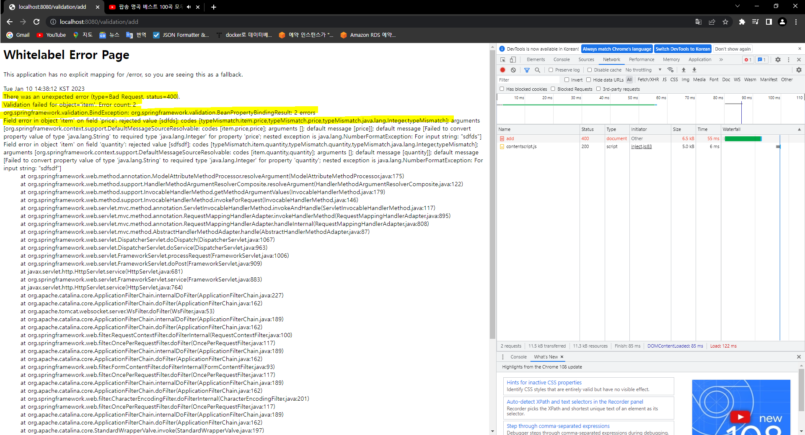
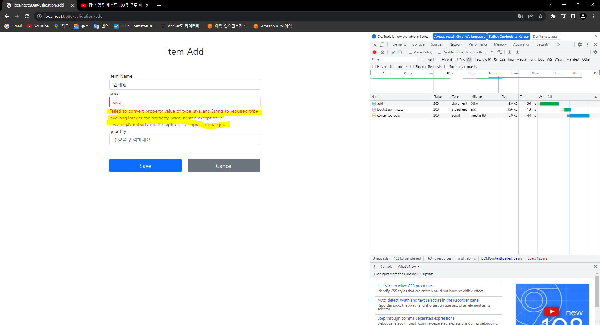

### BindingResult
스프링이 제공하는 **검증 오류를 보관하는 객체**이다. 검증 오류가 발생하면 BindingResult 객체에 보관하면 된다.<br>
BindingResult 가 있으면, @ModelAttribute 에 데이터 바인딩 시 오류가 발생해도 컨트롤러가 호출된다.<br>
즉, 데이터 바인딩 시 어떤 문제가 있는지 BindingResult 에 담긴다.<br>
* BindingResult 가 없으면 -> 400 오류가 발생하면서 컨트롤러가 호출되지 않고, 오류 페이지로 이동한다.
* BindingResult 가 있으면 -> 오류 정보를 BindingResult 에 담아서 컨트롤러를 정상 호출한다.

BindingResult 에 검증 오류를 적용하는 방법
* [@ModelAttribute 의 객체 타입 오류 등으로 바인딩이 실패하는 경우 스프링이 FieldError 를 생성해서 BindingResult 에 넣어준다.](#✔-스프링-검증)
* [개발자가 직접 넣어준다.](#✔-개발자-직접-검증)
* [Validator 사용](#✔-Validator-활용-검증)

---
#### ✔ 스프링 검증
** **다시 확인할 내용**<br>
@ModelAttribute 객체 타입 오류 등으로 바인딩이 실패하면, 스프링이 FieldError 를 생성해서 BindingResult 객체에 보관한다.<br>
BindingResult 선언 여부와 관계 없이, 스프링은 FieldError 를 생성해서 BindingResult 객체에 보관한다.<br>
다만, BindingResult 를 선언하지 않았을 때에는 컨트롤러가 호출되지 않고 400 오류 페이지를 리턴한다.<br>
반대로 BindingResult 를 선언하였을 때에는 컨트롤러가 호출되며 오류 정보를 BindingResult 에 담는다.<br>

(테스트 내용)<br>
BindingResult 선언하지 않았을 때, 에러와 함께 400 오류 페이지가 리턴된다.<br>


BindingResult 선언하였을 때, Spring 은 타입 체크를 진행하고 오류 메세지(형광펜 내용)를 담아놓는다.



#### ✔ 개발자 직접 검증
다음과 코드를 한번 확인해보자.
```
@PostMapping
public String saveV3(@ModelAttribute Item item, BindingResult bindingResult, Model model) {

        if (!StringUtils.hasText(item.getName())) {
            bindingResult.addError(new FieldError("item", "name", item.getName(), false, null, null, "상품 이름은 필수입니다."));
        }
        ..
}
```
request 로 들어온 Item 객체를 검증하기 위해 BindingResult 가 Item 객체 뒤에 선언되어 있다. (**검증 대상은 꼭 BindingResult 앞에 위치해야 한다.**)<br>
`if (!StringUtils.hasText(item.getName())` 코드를 통해 item 의 name 필드를 검증(비어있거나 null 이거나 등)하고 있다.<br>
만약 검증에 실패한다면, `BindingResult 에 FieldError 객체를 생성해서 에러 정보를 보관`한다.<br>
FieldError 에는 2가지 생성자가 존재하는데, [여기](https://docs.spring.io/spring-framework/docs/current/javadoc-api/org/springframework/validation/FieldError.html)를 통해 확인해보자.<br>
ObjectError 에도 2가지 생성자가 존재하는데, [여기](https://docs.spring.io/spring-framework/docs/current/javadoc-api/org/springframework/validation/ObjectError.html)를 통해 확인해보자.

### ✔ Validator 활용 검증
스프링에서 객체를 검증하기 위해 제공하는 유효성 검사기 인터페이스이다.<br>
```
public interface Validator {
    boolean supports(Class<?> clazz);
    void validate(Object target, Errors errors);
}
```
* supports : 해당 검증기를 지원하는 여부를 확인하기 위함
* validate : 검증대상과, 에러객체를 파라미터로 주고 검증을 진행

---

### MessageCodesResolver
MessageCodeResolver 는 유효성 검사 에러 코드에서 메시지 코드들을 만들어주기 위한 전략 인터페이스이다. - [참고 문서](https://docs.spring.io/spring-framework/docs/current/javadoc-api/org/springframework/validation/MessageCodesResolver.html)<br>
* 구현체로 DefaultMessageCodesResolver 가 있다.<br>
* FieldErrors : 필드에 오류가 있는 경우 발생하는 에러 객체
* ObjectErrors : 객체 자체에 오류가 있는 경우 발생하는 에러 객체
* FieldErrors, ObjectErrors 는 **BindingResult 객체에 보관되는 오류 객체**이다.
```
public interface MessageCodesResolver {

	String[] resolveMessageCodes(String errorCode, String objectName);

	String[] resolveMessageCodes(String errorCode, String objectName, String field, @Nullable Class<?> fieldType);

}
```

---
### Question
컨트롤러에서 `.properties` 파일의 변수에 어떻게 접근을 하는 것인지?<br>
> 뷰가 렌더링 하는 과정에서 해당 에러 객체를 처리하게 되는데, 이때 에러가 발생했다면 해당 에러와 관련된 메시지가 있는지 찾는다.<br>
> 이때 내부에 만들어진 프로퍼티 파일(message, errors)을 순회하며 이전에 저장해둔 key 에 해당하는 부분이 있는지 확인 후 key 의 value 를 가져온다. - 강의 답변

